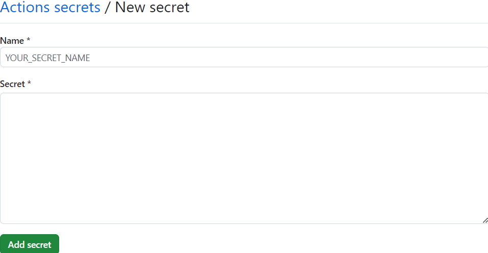
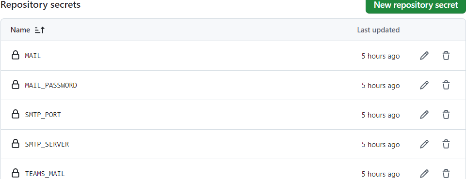
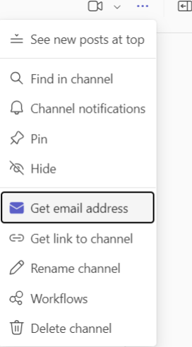

# Github tools

## General

The workflow `Build and send diploma thesis` allows the user to build the diploma thesis via a github workflow and send it to a Microsoft Teams channel.

## Create GitHub secrets

In your GitHub repository you first need to create the secrets the action needs. For that, go to the `Settings` Tab of your repository and under the section `Security` go to `Secrets and variables` and choose to the option `Actions`.


Now click on the button `New repository secret` to create the GitHub action secrets.



Here you enter the names of the secrets and their values corresponding to the following table. After inserting the contents of the new secret click `Add secret`.

| Name | Secret |
|-|-|
| MAIL | Your email address from which the diploma thesis should be sent from  |
| MAIL_PASSWORD | The password for MAIL |
| SMTP_PORT | The SMTP port corresponding to SMTP_SERVER |
| SMTP_SERVER | The SMTP Server for your email address |
| TEAMS_MAIL | The Teams channel email from the channel the diploma thesis should be sent to |

Now it should look like this:



## Setup with published action

In the repo that should use this workflow create a file `.github/workflows/thesis.yml` and paste following contents into it. Do not forget to create the secrets.

```yml
name: Build and send diploma thesis

on: 
  push:
  workflow_dispatch:

jobs:
  build-and-send:
    runs-on: ubuntu-latest

    steps:
      - name: Build and send diploma thesis
        uses: bitsneak/TestingDABuild@v0.1.3
        with:
          # if the folder where the template is filled out has a different name than 'Diplomarbeit'
          #thesis-path: folder_name

          smtp-server: ${{ secrets.SMTP_SERVER }}
          smtp-port: ${{ secrets.SMTP_PORT }}
          mail-address: ${{ secrets.MAIL }} # do not use school email address
          mail-address-password: ${{ secrets.MAIL_PASSWORD }} # when using gmail an app password must be used
          teams-mail: ${{ secrets.TEAMS_MAIL }}
```

## Setup without published action

### Microsoft Teams

1. Create a new channel in your Team named `build`.
2. Go to the channel settings of `build` and go to `Get email address`.



3. Copy the email address which is inside of the sharp brackets.

### GitHub

Create a folder `.github/workflows` in the root of your repository. You can now choose between `diploma-thesis-docker.yml` and `diploma-thesis-manual.yml` to paste into the newly created folder. The difference between them is, that the **-docker** uses the Docker image (for new diploma theses) and the **-manual** installs all the dependencies in the action itself (for old diploma theses).

### Notes

- Sending the diploma thesis, and therefore automated emails, using a school email address is not supported. Therefore use an email address that does not correspond to your school email address.
- If you use Gmail as a sending email address, you have to generate an app password and use this instead of your normal password. [Manual](https://knowledge.workspace.google.com/kb/how-to-create-app-passwords-000009237)

## Credentials

- ducumentation
  - Schrempf Marko
- code
  - Schrempf Marko
  - Kampl Maximilian
